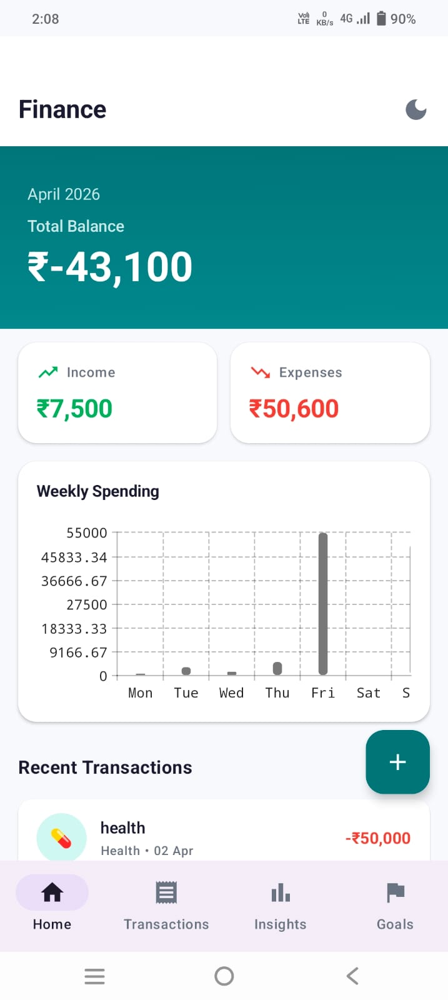
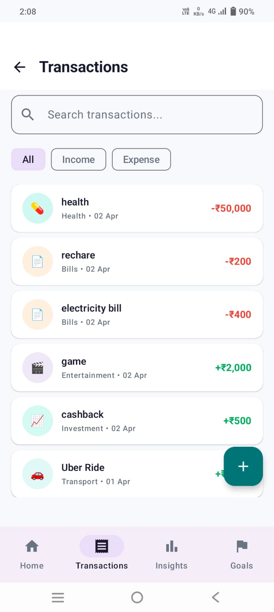
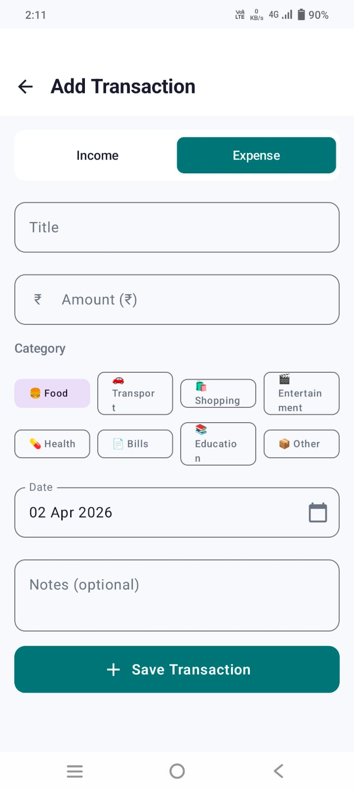
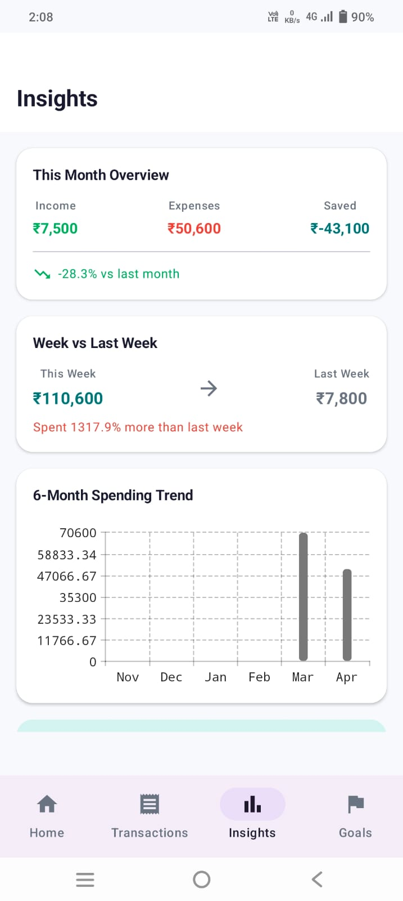
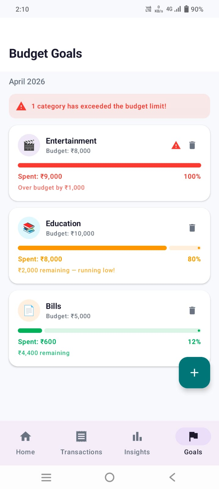
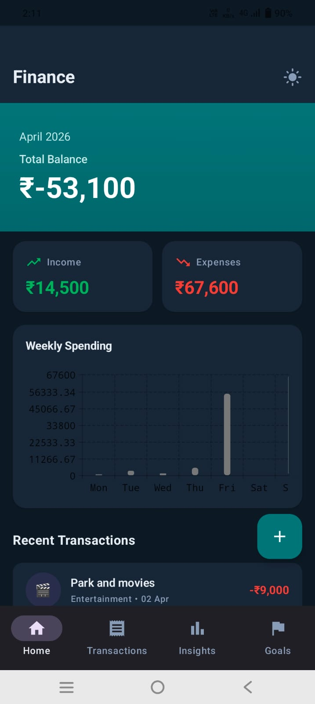

# 💰 FinanceBoss

A personal finance Android app that helps users understand their daily money habits in a simple and engaging way. Built with Kotlin, Jetpack Compose, Room, and MVVM architecture.

---


### Screenshots

| Home Dashboard | Transactions | Add Transaction |
|---|---|---|
|  |  |  |

| Insights | Budget Goals | Dark Mode |
|---|---|---|
|  |  |  |


---

## ✨ Features

### 1. Home Dashboard
- **Total Balance** — calculated live as income minus expenses for the current month
- **Income & Expense Summary Cards** — at a glance monthly overview
- **Weekly Spending Bar Chart** — 7-day spending trend powered by Vico charts
- **Recent Transactions** — last 5 transactions with quick access to full list
- **Dark Mode Toggle** — switch between light and dark theme from the home screen

### 2. Transaction Tracking
- **Add Transactions** — full form with amount, type (income/expense), category, date picker, and notes
- **Edit Transactions** — tap any transaction to open pre-filled edit form
- **Delete Transactions** — swipe left to delete with Undo snackbar
- **Search** — live search across transaction titles and notes
- **Filter** — filter by Income or Expense type instantly

### 3. Budget Goals (Creative Feature)
- Set a **monthly budget limit per spending category**
- Real-time progress bars showing how much of each budget is spent
- **3-color system** — Green (safe), Amber (80%+ spent), Red (over budget)
- **Over-budget warning banner** when any category exceeds its limit
- Add and delete budget goals anytime

### 4. Insights Screen
- **Monthly Overview** — income, expenses, and savings for the current month
- **Month-over-month comparison** — % change vs last month
- **Week vs Last Week** — spending comparison with % difference
- **6-Month Trend Chart** — bar chart showing monthly expense trend
- **Top Spending Category** — highlighted card showing biggest expense area
- **Category Breakdown** — all categories with amounts, percentages, and progress bars

### 5. UX Polish
- Shimmer loading animation on home screen
- Empty states with contextual guidance on every screen
- Form validation with inline error messages
- Seed data pre-loaded on first launch for immediate demo experience
- Dark mode preference persists across app restarts

---

## 🏗️ Architecture

The app follows **MVVM (Model-View-ViewModel)** with a **Repository pattern** and **manual dependency injection** via `AppContainer`.

```
┌─────────────────────────────────────────┐
│              UI Layer                   │
│   Compose Screens + ViewModels          │
│   StateFlow → collectAsStateWithLife-   │
│   cycle → UI reacts to state changes   │
└────────────────┬────────────────────────┘
                 │
┌────────────────▼────────────────────────┐
│           Repository Layer              │
│   TransactionRepository                 │
│   GoalRepository                        │
│   Abstracts data source from UI         │
└────────────────┬────────────────────────┘
                 │
┌────────────────▼────────────────────────┐
│            Data Layer                   │
│   Room Database (SQLite)                │
│   TransactionDao + GoalDao              │
│   DataStore (user preferences)          │
└─────────────────────────────────────────┘
```

### Dependency Injection
Manual DI is used via `AppContainer` — a single class instantiated in `FinanceApplication` that holds the database, repositories, and preferences as lazy singletons. ViewModels are created using `ViewModelProvider.Factory` in `NavGraph`, keeping all wiring in one place.

---

## 🛠️ Tech Stack

| Technology | Purpose |
|-----------|---------|
| **Kotlin** | Primary language |
| **Jetpack Compose** | Declarative UI framework |
| **Room (SQLite)** | Local persistent database |
| **DataStore Preferences** | Lightweight key-value storage for user settings |
| **ViewModel + StateFlow** | State management and lifecycle awareness |
| **Navigation Compose** | Type-safe screen routing |
| **Vico Charts** | Compose-native bar charts |
| **Material 3** | Design system and components |
| **coroutines + Flow** | Async data streams from Room |

---

## 📁 Project Structure

```
com.example.financeboss/
│
├── data/
│   ├── local/
│   │   ├── dao/
│   │   │   ├── TransactionDao.kt       # All transaction queries
│   │   │   └── GoalDao.kt              # All goal queries
│   │   ├── entity/
│   │   │   ├── TransactionEntity.kt    # Transaction + enums
│   │   │   └── GoalEntity.kt           # Budget goal model
│   │   └── AppDatabase.kt              # Room database + converters
│   ├── repository/
│   │   ├── TransactionRepository.kt    # Transaction data operations
│   │   └── GoalRepository.kt          # Goal data operations
│   ├── preferences/
│   │   └── UserPreferences.kt          # DataStore (dark mode, seed flag)
│   └── SeedData.kt                     # Demo data for first launch
│
├── di/
│   └── AppContainer.kt                 # Manual DI container
│
├── ui/
│   ├── theme/
│   │   ├── Color.kt                    # App color palette
│   │   └── Theme.kt                    # Light + dark MaterialTheme
│   ├── navigation/
│   │   ├── Screen.kt                   # Route definitions
│   │   └── NavGraph.kt                 # Navigation + ViewModel creation
│   ├── components/
│   │   ├── TransactionCard.kt          # Reusable transaction list item
│   │   ├── SummaryCard.kt              # Reusable summary metric card
│   │   ├── EmptyState.kt               # Reusable empty state component
│   │   └── LoadingShimmer.kt           # Shimmer loading animation
│   ├── home/
│   │   ├── HomeScreen.kt
│   │   ├── HomeViewModel.kt
│   │   └── HomeViewModelFactory.kt
│   ├── transactions/
│   │   ├── TransactionScreen.kt
│   │   ├── TransactionViewModel.kt
│   │   ├── TransactionViewModelFactory.kt
│   │   ├── AddEditTransactionScreen.kt
│   │   ├── AddEditTransactionViewModel.kt
│   │   └── AddEditTransactionViewModelFactory.kt
│   ├── insights/
│   │   ├── InsightsScreen.kt
│   │   ├── InsightsViewModel.kt
│   │   └── InsightsViewModelFactory.kt
│   └── goals/
│       ├── GoalScreen.kt
│       ├── GoalViewModel.kt
│       └── GoalViewModelFactory.kt
│
├── FinanceApplication.kt               # App entry point, creates AppContainer
├── MainActivity.kt                     # Single activity, sets up Compose
├── MainViewModel.kt                    # App-level VM (dark mode, seeding)
└── MainViewModelFactory.kt
```

---

## 🚀 Getting Started

### Prerequisites
- Android Studio Hedgehog (2023.1.1) or later
- JDK 17
- Android device or emulator running API 26 (Android 8.0) or higher

### Steps

1. **Clone the repository**
   ```bash
   git clone https://github.com/SanskarP819/FinanceBoss.git
   ```

2. **Open in Android Studio**
   - File → Open → select the cloned folder

3. **Sync Gradle**
   - Android Studio will prompt to sync — click **Sync Now**
   - Wait for all dependencies to download

4. **Run the app**
   - Select a device or emulator (API 26+)
   - Click the ▶ Run button

> No API keys, backend setup, or environment variables required. The app runs fully offline using local Room database.

---

## 💡 Design Decisions & Assumptions

### Currency
INR (₹) is used as the default currency. The formatting is centralized in the card and transaction components, making it straightforward to adapt for other currencies.

### Data Storage
Room (SQLite) was chosen over mock data or DataStore because it supports complex queries needed for the Insights screen — filtering by date range, grouping by category, and summing amounts. This also demonstrates proper mobile data handling.

### Manual Dependency Injection
Hilt was intentionally avoided in favor of a clean manual DI approach using `AppContainer`. This keeps the project dependency-free from annotation processors and makes the dependency graph explicit and easy to follow in a single file.

### Budget Goals Scope
Budget goals are scoped to the current month and year. When a new month starts, previous goals don't carry over — users set fresh budgets each month. This keeps the feature simple and focused.

### Seed Data
15 realistic transactions and 4 budget goals are pre-loaded on first launch. This ensures evaluators and new users can immediately see a populated, functional app without having to manually enter data. The seed flag is stored in DataStore so it only runs once.

### No Backend / API
This is a personal finance companion — a lightweight local tool. A backend would add complexity without adding value for the core use case of personal expense tracking. All data lives on-device.

---

## 👤 Author

Sanskar Pandey
- GitHub:(SanskarP819)https://github.com/SanskarP819/
- Email: sanskar8707@gmail.com

---

